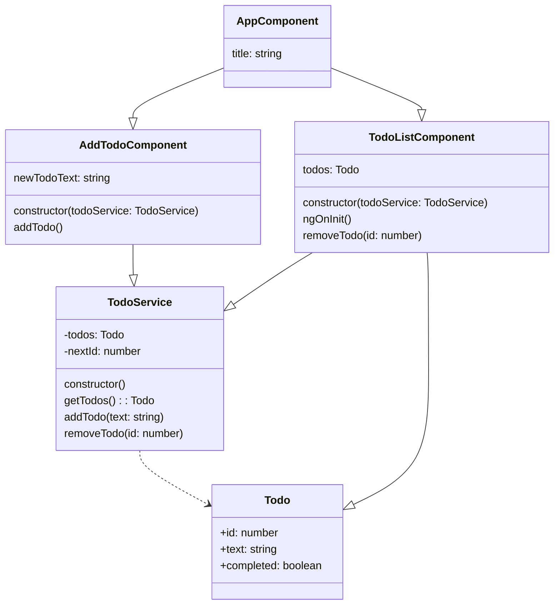

# Meu To-Do List

Este é um aplicativo simples de lista de tarefas (To-Do List) desenvolvido com Angular. Ele permite que você adicione, visualize e exclua tarefas, ajudando na organização do seu dia a dia.

## Tecnologias Utilizadas

* [Angular](https://angular.io/)
* [TypeScript](https://www.typescriptlang.org/)
* HTML
* CSS

## Funcionalidades

* **Adicionar novas tarefas:** Permite que o usuário insira e adicione novas atividades à sua lista.
* **Visualizar a lista de tarefas:** Exibe todas as tarefas adicionadas de forma clara e organizada.
* **Excluir tarefas da lista:** Oferece a funcionalidade de remover tarefas que já foram concluídas ou não são mais necessárias.

## Contribuição

Se você quiser contribuir para este projeto, sinta-se à vontade para abrir uma issue para relatar problemas ou sugerir melhorias. Pull requests com contribuições são bem-vindos!

